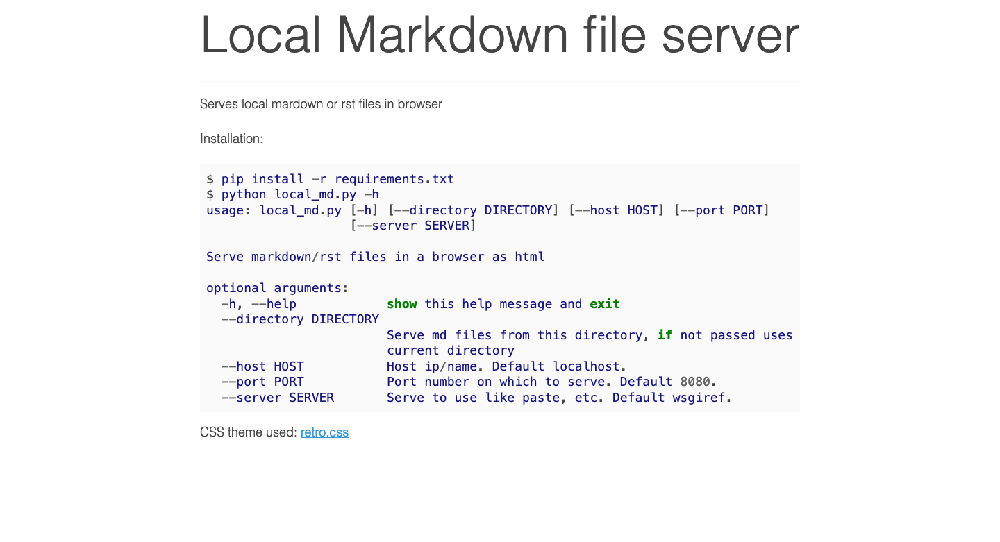

# Local Markdown file server

Serves local mardown or rst files in browser

Installation and use:
```
$ pip install -r requirements.txt
$ python local_md.py -h
usage: local_md.py [-h] [--host HOST] [--port PORT] [--server SERVER]
                   DIRECTORY

Serve markdown/rst files in a browser as html

positional arguments:
  DIRECTORY        Serve md files from this directory, if not passed uses
                   current directory

optional arguments:
  -h, --help       show this help message and exit
  --host HOST      Host ip/name. Default localhost.
  --port PORT      Port number on which to serve. Default 8080.
  --server SERVER  Serve to use like paste, etc. Default wsgiref..
```

You can test with sample directoy md_files:
```
$ python local_md.py --directory md_files
$ # and check in http://localhost:8080
```

CSS theme used: [modest.css](https://github.com/markdowncss/modest)

Looks like this:

